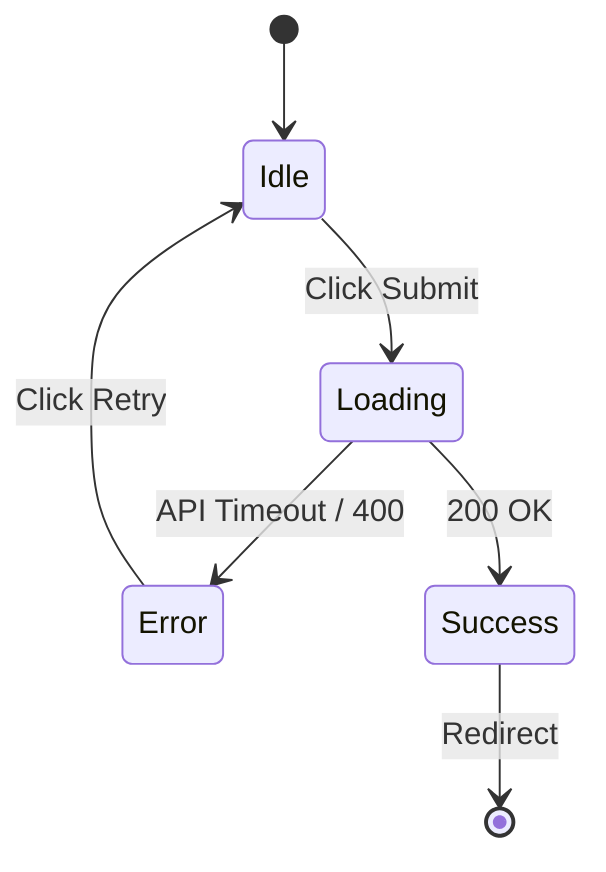

# Stage 1.5 原型与状态流规约 (Prototype & State Flow)

> **触发条件**: 仅当 Commander 确认当前项目涉及 UI 界面或客户端交互时，由 Lead 角色负责输出。纯后端 API 或 CLI 工具跳过此流。

## 1. 产出物存放目录

所有的 UI 设计草图、交互原型文件必须存放在 `pipeline/1_5_prototype/UI_Mockups/` 目录下。

## 2. 状态扭转规约 (`State_Flow.md`)

除了静态截图，复杂的界面必须在 `pipeline/1_5_prototype/State_Flow.md` 中定义它的动态行为路径。

### 官方模板

````markdown
# [页面名] 核心交互状态流

<!-- Author: Lead -->

## 1. 初始挂载状态 (Initial Render)

- **数据加载**: 是否有 Skeleton 骨架屏？
- **默认焦点**: 光标默认停留在哪个输入框？

## 2. 核心状态机 (State Machine)

使用简单的 Mermaid 状态图描述页面状态的扭转。


````

## 3. 错误降级视图 (Error Boundaries & Empty States)

- 当无数据时 (Empty State)，界面显示什么？（例如：一个“建立第一个任务”的空状态插画）
- 当组件崩溃时 (Error Boundary)，用户是否能看到降级的 Fallback UI？

```

```
