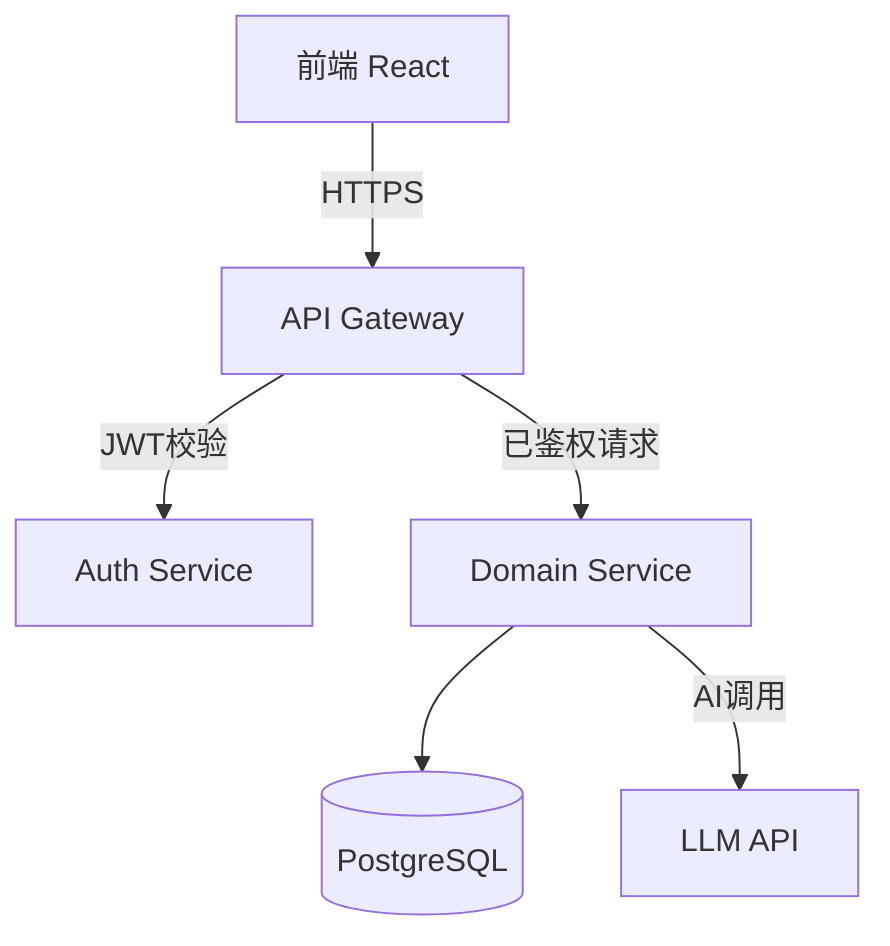
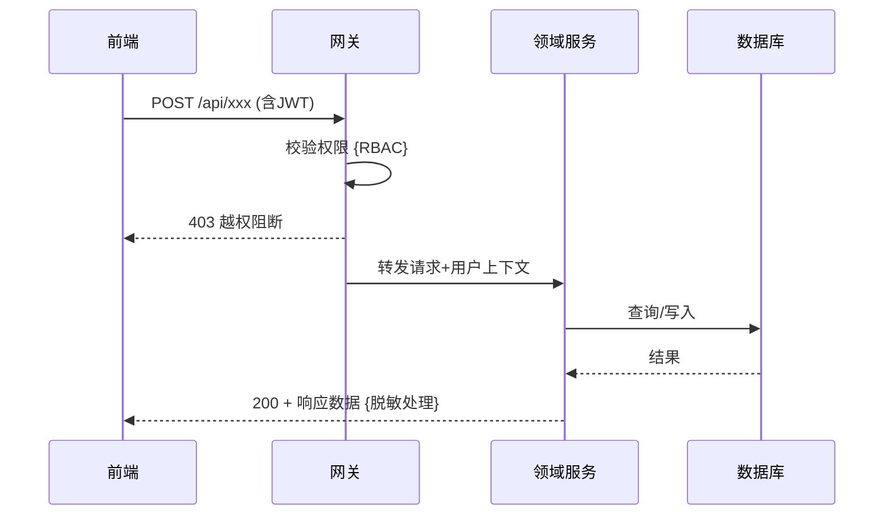

# fusion-arch-blueprint — 系统架构蓝图


---

## ⚡ 执行前 FP 两问（强制）

1. **我们的目的是什么？**
   → 产出 FE/BE 独立开发的技术契约
2. **这些步骤已经不可原子级再分了吗？**
   → 系统设计 → 接口契约 → 数据模型 → ADR，顺序不可颠倒，不可合并。

---

## 前置验证

必须确认以下文件已存在且已 APPROVED：

```
[x] pipeline/0_requirements/PRD.md
[x] pipeline/0_requirements/FEATURE_LIST.md
[x] pipeline/0_5_prototype/UI_CONTRACT.md（若 Stage 0.5 非 SKIP）
```

---

## 执行序列

### Step 1: 系统边界分析

从 PRD + UI_CONTRACT 中提取：

- 用户角色（哪些角色对应哪些操作权限）
- 系统组件（前端层 / 网关层 / 领域服务层 / 数据层）
- 外部依赖（第三方 API / LLM / 支付等）

### Step 2: 产出 System_Design.md

````markdown
<!-- Author: Lead -->

# System Design

## 系统边界

[描述系统的整体组成和边界]

## 组件图（Mermaid）


````

## 关键业务流程（时序图）

对每个核心用户场景（来自 BDD_Scenarios）输出时序图：



## 安全边界标注

- `{RBAC}`: 权限检查点
- `{Masked}`: 数据脱敏点
- `{Rate-Limited}`: 速率限制点

````

**铁律**:
- 禁止出现具体函数名或类名
- 必须标注所有安全检查点（{RBAC}/{Masked}）
- 每个组件职责用一句话说清楚

### Step 3: 产出 INTERFACE.md

**INTERFACE 铁律**: 每个接口必须标注来源 F-ID，覆盖率 100%。

```markdown
<!-- Author: Lead -->

# INTERFACE.md — 前后端接口契约

> FE 和 BE 读完本文件即可独立开发，互不等待。
> 每个接口均标注来源 F-ID，覆盖率 100%。

## F-ID 覆盖矩阵

| F-ID | 功能名称 | 接口数量 | 接口列表 |
|------|---------|---------|---------|
| F1.1 | 用户登录 | 1 | POST /api/auth/login |
| F1.2 | 密码找回 | 2 | POST /api/auth/forgot-password, POST /api/auth/reset-password |

## 接口规格

### POST /api/auth/login
**来源 F-ID**: F1.1
**权限**: 公开（无需认证）

**Request Body**:
```json
{
  "email": "string (required, email format)",
  "password": "string (required, min 8 chars)"
}
````

**Response (200 Success)**:

```json
{
  "success": true,
  "data": {
    "token": "string (JWT)",
    "user": { "id": "string", "name": "string", "role": "string" }
  }
}
```

**Response (401 Unauthorized)**:

```json
{
  "success": false,
  "error": { "code": "ERR_INVALID_CREDENTIALS", "message": "邮箱或密码错误" }
}
```

**状态码**: 200 / 400 / 401 / 429（频率限制）

````

### Step 4: 产出 Data_Models.md

```markdown
<!-- Author: Lead -->

# Data Models

## 核心实体

### User（用户）

| 字段 | 类型 | 约束 | 说明 |
|------|------|------|------|
| id | UUID | PK, NOT NULL | 主键 |
| email | VARCHAR(255) | UNIQUE, NOT NULL | 登录邮箱 |
| password_hash | VARCHAR(255) | NOT NULL | bcrypt 哈希 |
| role | ENUM('user','admin') | NOT NULL, DEFAULT 'user' | 角色 |
| created_at | TIMESTAMP | NOT NULL, DEFAULT NOW() | 创建时间 |

**并发保护方案**: [乐观锁 version 字段 / 悲观锁 / 无需保护（说明原因）]

## 实体关系图（Mermaid）

```mermaid
erDiagram
    User ||--o{ Order : "has"
    Order ||--|{ OrderItem : "contains"
````

````

### Step 5: 产出 ADR（每个重大技术决策一份）

存放路径: `pipeline/1_architecture/ADR/ADR-001-[决策主题].md`

```markdown
<!-- Author: Lead -->

# ADR-001: [决策标题]

## 背景（Context）

[是什么技术难题迫使我们必须做选择？]

## 考虑的选项（Options）

| 选项 | 优点 | 缺点 |
|------|------|------|
| 选项 A | ... | ... |
| 选项 B | ... | ... |

## 决策（Decision）

选择 [选项X]。

**原因**: [具体理由，优先援引 FP 两问]

## 后果（Consequences）

- 正向: [积极影响]
- 负向: [需要接受的代价]
- 被拒方案: [选项Y] 因为 [原因] 被放弃
````

---

### Step 6: 更新 FEATURE_LIST.md 追踪总表"接口"列

打开 `pipeline/0_requirements/FEATURE_LIST.md`，在追踪总表中为每个 F-ID 填入对应的接口编号：

```
| F1.1 | 用户登录 | ✅ | S-01 | POST /api/auth/login | ...
| F1.2 | 密码找回 | ✅ | S-01 | POST /api/auth/forgot-password, POST /api/auth/reset-password | ...
```

接口编号来自 INTERFACE.md 的 F-ID 覆盖矩阵。覆盖率必须 100%。

---

## 质量闸门

- [ ] System_Design.md 包含组件图 + 核心业务时序图
- [ ] INTERFACE.md 中每个 F-ID 至少有 1 个接口（F-ID 覆盖率 100%）
- [ ] FEATURE_LIST.md 追踪总表"接口"列已全部填入（覆盖率 100%）
- [ ] Data_Models.md 包含所有核心实体 + 并发保护方案
- [ ] 每个重大技术决策有对应 ADR（至少 1 份）
- [ ] 零业务代码（无 class / function / const 等编程语法）

**自检通过 → 通知 Architecture Consultant 启动对抗审查。**

---

## Stage 1.5: 冲突屏幕修订（条件触发）

**触发条件**: Stage 1 发现 Stage 0.5 原型中有技术不可行的交互时执行。无冲突 → Commander 标记 SKIP。

**铁律**: 只修改有架构冲突的屏幕，禁止借机重新设计无关交互。

**产出物**:

| 产出物 | 路径 | 数量约束 |
|--------|------|---------|
| 修订原型 | `pipeline/1_5_prototype/Revised_Mockups/` | = 冲突屏幕数（不多不少），文件名加 `-revised` 后缀 |
| 状态流 | `pipeline/1_5_prototype/State_Flow.md` | 仅受影响屏幕（若有状态转换变更） |

> State_Flow.md Mermaid 状态图模板 → `.claude/rules/prototype-state-flow.md`
